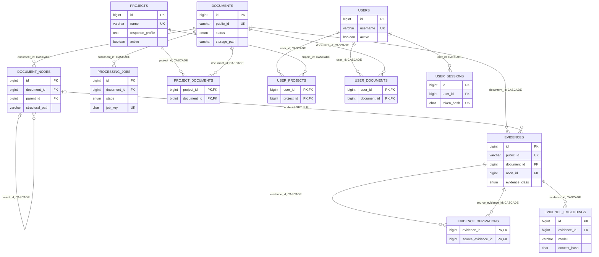

# Relacionamento do banco de dados

## Objetivo e fonte de verdade

Este documento explica como as tabelas MySQL/MariaDB do EVA atuam em conjunto. Ele complementa [`07_BANCO_DE_DADOS.md`](07_BANCO_DE_DADOS.md), que descreve o que é persistido, com as cardinalidades, as chaves estrangeiras, os vínculos lógicos usados pela aplicação e os efeitos reais de cada ciclo de vida.

A fonte estrutural é [`database/schema.sql`](../database/schema.sql), complementada pelas migrações versionadas em [`database/migrations/`](../database/migrations/). A fonte comportamental são os serviços que gravam, consultam e excluem esses registros. No estado atual, o banco principal possui 14 tabelas e 15 chaves estrangeiras.

## Visão relacional



`audit_events` e `module_events` ficam propositalmente fora do diagrama de FKs. Elas possuem relações lógicas descritas adiante, mas não subordinam seu ciclo de vida às entidades do Core.

## Matriz das chaves estrangeiras

| Tabela dependente | Coluna | Tabela referenciada | Cardinalidade efetiva | Ao excluir a referência | Função |
|---|---|---|---|---|---|
| `document_nodes` | `document_id` | `documents.id` | um documento → zero ou muitos nós | `CASCADE` | Mantém toda a árvore dentro de uma única obra. |
| `document_nodes` | `parent_id` | `document_nodes.id` | um nó pai → zero ou muitos filhos; a raiz usa `NULL` | `CASCADE` | Forma a hierarquia documental normalizada. |
| `evidences` | `document_id` | `documents.id` | um documento → zero ou muitas evidências | `CASCADE` | Permite filtrar e excluir a memória da obra sem reconstruir a árvore. |
| `evidences` | `node_id` | `document_nodes.id` | um nó → zero ou muitas evidências; a coluna aceita `NULL` | `SET NULL` | Ancora conteúdo primário e sínteses ao ponto estrutural que os originou. |
| `evidence_derivations` | `evidence_id` | `evidences.id` | uma evidência derivada → zero ou muitas fontes | `CASCADE` | Identifica a síntese cuja linhagem está sendo declarada. |
| `evidence_derivations` | `source_evidence_id` | `evidences.id` | uma evidência fonte → zero ou muitas derivações | `CASCADE` | Identifica cada evidência primária ou derivada que alimentou a síntese. |
| `evidence_embeddings` | `evidence_id` | `evidences.id` | uma evidência → zero ou muitas versões vetoriais | `CASCADE` | Mantém vetores subordinados ao conteúdo persistido. |
| `processing_jobs` | `document_id` | `documents.id` | um documento → zero ou muitos trabalhos versionados | `CASCADE` | Vincula fila e resultado operacional à obra processada. |
| `project_documents` | `project_id` | `projects.id` | projeto ↔ documento, muitos para muitos | `CASCADE` | Define as obras que compõem cada projeto. |
| `project_documents` | `document_id` | `documents.id` | projeto ↔ documento, muitos para muitos | `CASCADE` | Permite que uma obra pertença a mais de um projeto. |
| `user_projects` | `user_id` | `users.id` | usuário ↔ projeto, muitos para muitos | `CASCADE` | Concede acesso integral às obras atuais de um projeto ativo. |
| `user_projects` | `project_id` | `projects.id` | usuário ↔ projeto, muitos para muitos | `CASCADE` | Remove automaticamente a concessão se o projeto deixar de existir. |
| `user_documents` | `user_id` | `users.id` | usuário ↔ documento, muitos para muitos | `CASCADE` | Concede acesso direto a uma obra específica. |
| `user_documents` | `document_id` | `documents.id` | usuário ↔ documento, muitos para muitos | `CASCADE` | Remove automaticamente a concessão se a obra for excluída. |
| `user_sessions` | `user_id` | `users.id` | um usuário → zero ou muitas sessões | `CASCADE` | Subordina autenticação persistida à identidade normal. |

Todas as FKs usam `ON UPDATE RESTRICT`. Os IDs numéricos internos não são renomeados; a API utiliza identificadores públicos estáveis quando a entidade possui esse contrato.

## Núcleo documental

### `documents` como raiz de agregação

`documents` é a raiz persistente de uma obra. Seu `id` conecta árvore, evidências, fila, projetos e permissões. `public_id` (`EVA-D...`) é a referência externa estável; `storage_path` aponta para o arquivo original fora do banco e fora da pasta pública.

O estado controla o ciclo de vida:

1. `received`: registro criado e identificador público definido;
2. arquivo original armazenado e `storage_path` preenchido;
3. `processing`: árvore e evidências primárias entram em transação;
4. `ready`: a obra pode ser enfileirada e consultada;
5. `failed`: uma falha de armazenamento ou persistência impediu a conclusão.

`source_hash` identifica o conteúdo recebido, mas não é uma chave única: o schema permite manter dois registros de documento com o mesmo hash.

Se o arquivo já tiver sido armazenado e a transação da árvore falhar, o registro fica `failed` com `storage_path` preservado. A exclusão administrativa posterior usa esse caminho para remover a fonte; o banco não apaga arquivos por conta própria.

### `document_nodes` como árvore

Cada nó pertence obrigatoriamente a um documento. `parent_id` aponta para a própria tabela e é `NULL` apenas na raiz de cada árvore criada pela ingestão. `depth` e `sort_order` permitem reconstruir hierarquia e ordem; `structural_path` é único dentro do documento por `uq_nodes_path`.

O banco garante que pai e filho sejam linhas válidas, mas não garante por FK que ambos tenham o mesmo `document_id`. Essa coerência é uma invariável do parser e do `DocumentIngestionService`, que persiste recursivamente todos os filhos com o mesmo documento.

### `evidences` como unidade citável ou localizadora

Uma evidência pertence obrigatoriamente a um documento e normalmente ao nó que a originou:

- `primary` + `node_content`: cópia rastreável do conteúdo direto do nó, criada como `validated` durante a ingestão;
- `derived` + `node_summary`: síntese hierárquica, criada como `generated` para localização e navegação semântica.

O vínculo direto `evidences.document_id` é intencional, embora o documento também possa ser alcançado por `node_id`. Ele é usado nas consultas de escopo, construção, recuperação e exclusão. A aplicação cria as evidências atuais com `node_id`; a nulabilidade e o `SET NULL` preservam a linha caso um nó isolado seja removido diretamente.

`public_id` (`EVA-E...`) é a referência visível nas citações. Para sínteses, a combinação `node_id + evidence_type + generation_model + generation_input_hash` evita recriar a mesma versão gerencial.

### `evidence_derivations` como grafo de proveniência

Esta tabela é uma associação dirigida entre duas linhas de `evidences`:

```text
evidence_id (síntese produzida) → source_evidence_id (entrada usada)
```

A chave primária composta impede repetir o mesmo arco. Uma síntese de folha pode apontar para a evidência primária do próprio nó. Uma síntese de nível superior pode apontar para o conteúdo primário próprio e para sínteses dos filhos, formando um grafo hierárquico derivado.

As duas FKs garantem existência e cascata, mas a aplicação é quem garante que `evidence_id` seja `derived`, que as fontes pertençam ao mesmo documento e que a construção não crie ciclo. Na consulta semântica, uma síntese selecionada é percorrida recursivamente por essa tabela até chegar às evidências primárias; somente estas podem compor a resposta citável.

### `evidence_embeddings` como índice vetorial versionado

Cada vetor pertence a uma evidência. A restrição `evidence_id + model + content_hash` impede duplicar a mesma representação, ao mesmo tempo em que permite versões diferentes por modelo ou conteúdo estruturado.

O build lê `evidences`, `documents` e `document_nodes` para montar o texto estruturado. Na consulta, o Retriever junta `evidences` a `evidence_embeddings`, seleciona o registro de maior `id` para o modelo ativo e calcula similaridade em memória. O vetor da pergunta, as similaridades e as regiões do CIE não viram registros SQL.

## Processamento cognitivo

### `processing_jobs`

Cada trabalho pertence a um documento pronto e representa apenas uma das etapas `summaries` ou `embeddings`. `job_key` é o hash de `document_id + stage + version_key`; sua unicidade torna o agendamento idempotente para a mesma configuração.

Não existe FK entre um trabalho de síntese e um trabalho de embedding. A dependência é lógica e implementada na reivindicação da fila: um job de `embeddings` somente pode entrar em `running` quando o job de `summaries` mais recente daquele documento estiver `completed`. Ao retomar uma síntese com falha, um embedding pareado já concluído pode voltar para `queued` para refletir a nova versão derivada.

O campo `result` registra o resultado operacional serializado. Ele não substitui `evidences`, `evidence_derivations` ou `evidence_embeddings`, que são a memória documental efetiva.

## Projetos, usuários e autorização

### `projects` + `project_documents`

`project_documents` implementa a relação muitos-para-muitos. Um projeto pode não conter obras; uma obra pode não pertencer a projeto ou pertencer a vários. A chave primária composta impede repetir o mesmo vínculo.

`projects.response_profile` é governança complementar. Ele entra na geração somente quando o projeto é selecionado explicitamente e autorizado. Selecionar individualmente uma obra que pertence a um projeto não ativa seu perfil.

### `users` + tabelas de concessão

`users` contém apenas identidades normais. O superadmin é identificado pelo token administrativo da configuração e não possui linha obrigatória nessa tabela.

O acesso de um usuário normal a uma obra pronta é a união de dois caminhos:

```text
acesso direto: users → user_documents → documents
acesso por projeto: users → user_projects → projects ativos → project_documents → documents
```

Uma linha em `user_projects` concede o projeto inteiro e acompanha alterações futuras em `project_documents`. Uma linha em `user_documents` concede somente a obra indicada. Se ambas cobrirem a mesma obra, a resolução deduplica o `document_id`.

Para consultar um escopo do tipo `project`, o usuário precisa de `user_projects`; possuir apenas permissões individuais sobre algumas obras do projeto não concede o projeto completo nem ativa seu perfil de respostas.

### `user_sessions`

Cada sessão pertence a um usuário e guarda apenas `token_hash`. A autenticação junta `user_sessions` a `users`, exige usuário ativo, validade temporal e token compatível, e então atualiza `last_used_at`.

Excluir um usuário remove sessões e concessões por cascata. Desativar, redefinir senha ou recuperar acesso também revoga sessões explicitamente pela aplicação, embora o usuário continue existindo.

## Relações lógicas sem chave estrangeira

### `audit_events`

`entity_type + entity_id` é uma referência polimórfica de observabilidade, não uma FK. Conforme o evento, `entity_id` pode conter um ID numérico, um identificador público ou uma rota. Isso permite preservar a trilha sanitizada depois que a entidade operacional foi excluída.

Consequências deliberadas:

- excluir usuário, projeto, documento ou job não apaga automaticamente sua auditoria;
- o banco não valida a existência atual da entidade mencionada;
- `metadata` é um snapshot sanitizado e não deve ser usado como fonte da memória documental;
- endereço de rede entra apenas como hash e chaves sensíveis são redigidas antes do `INSERT`.

### `module_events`

`module_events` é uma caixa postal append-oriented criada diretamente pelo schema consolidado. A migration `20260803_010_module_events.sql` preserva o caminho de upgrade para bancos anteriores. `event_id` único fornece idempotência; `id` fornece a ordem monotônica consumida pelos cursores privados dos módulos. A única exclusão prevista pelo Runtime é a retenção administrativa explícita por data.

O JSON do evento pode conter snapshots permitidos de usuário, projetos, documentos e IDs públicos de evidência, mas não possui FKs para essas tabelas. Portanto, excluir uma entidade do Core não reescreve nem remove automaticamente um evento já emitido. Cada módulo copia e transforma o que precisa em seu próprio SQLite; esse estado não integra o modelo relacional MySQL.

### Arquivo-fonte original

`documents.storage_path` relaciona a linha a um arquivo em `storage/documents/`, mas o banco não pode aplicar integridade referencial ao sistema de arquivos. A exclusão normal usa `ContentDeletionService`: confirma a transação SQL primeiro e remove a fonte depois, reportando separadamente qualquer falha de limpeza física.

### Identificadores públicos

`documents.public_id`, `evidences.public_id` e `processing_jobs.public_id` não se relacionam por FK. Eles são contratos externos únicos usados por API, citações, auditoria e eventos. As relações internas e os joins de consistência continuam usando os IDs numéricos.

## Como as tabelas cooperam nos fluxos reais

### 1. Ingestão

```text
documents
  └─ document_nodes (árvore recursiva)
       └─ evidences primary/node_content
```

O documento nasce antes da árvore para receber ID e caminho de armazenamento. Nós e evidências primárias são inseridos na mesma transação. Cada evidência primária repete `document_id` e aponta para o `node_id` correspondente.

### 2. Síntese hierárquica

```text
document_nodes + evidences primárias/derivadas
  → nova evidences derived/node_summary
  → evidence_derivations para cada fonte usada
```

O processamento ocorre de baixo para cima. A linhagem permite que uma síntese superior seja rastreada por outras sínteses até o conteúdo primário original.

### 3. Embeddings

```text
documents + document_nodes + evidences elegíveis
  → texto estruturado versionado
  → evidence_embeddings
```

Se uma evidência primária exceder o orçamento seguro, ela só deixa de receber vetor próprio quando existir uma síntese derivada compatível que a represente por `evidence_derivations`.

### 4. Consulta

```text
permissões → documents prontos
documents + document_nodes + evidences
evidences + evidence_embeddings → seleção semântica/CIE
evidences derived + evidence_derivations → fontes primary
primary evidences → resposta e citações
```

Rotas diretas, estruturais e amplas leem primárias por conteúdo e posição. Rotas conceituais e relacionais também usam embeddings; qualquer candidata derivada é resolvida para primárias antes da geração. O banco não recebe CNodes, similaridades ou contexto conversacional.

### 5. Resposta concluída

```text
resposta validada
  ├─ audit_events: ocorrência sanitizada
  └─ module_events: envelope modular permitido e idempotente
```

Essas duas gravações são operacionais e não alteram `documents`, `document_nodes`, `evidences`, derivações ou embeddings.

### 6. Exclusão

Excluir uma obra pela aplicação remove a linha de `documents`; as FKs eliminam nós, evidências, vetores, derivações, jobs, vínculos de projeto e permissões diretas. Depois do commit, o serviço trata o arquivo armazenado.

Excluir um projeto pela aplicação possui uma regra adicional que não vem das FKs: o serviço primeiro exclui todas as obras vinculadas, inclusive obras compartilhadas com outro projeto, e depois exclui o projeto. Um `DELETE` SQL isolado em `projects`, por outro lado, eliminaria apenas `project_documents` e `user_projects`. Operações administrativas devem usar o serviço do produto.

| Entidade excluída | Efeito relacional automático | Efeito adicional da aplicação | Registros preservados |
|---|---|---|---|
| Documento | nós, evidências, derivações ligadas, embeddings, jobs, `project_documents`, `user_documents` | remoção do arquivo-fonte | auditoria e eventos modulares |
| Projeto via produto | `project_documents` e `user_projects` | exclusão prévia de todas as obras vinculadas e suas fontes | auditoria e eventos modulares |
| Usuário | sessões, `user_projects`, `user_documents` | nenhum arquivo associado | auditoria e eventos modulares |
| Evidência | embeddings e todos os arcos em que ela é destino ou fonte | não é uma operação administrativa isolada normal | documento e nó |
| Nó isolado | descendentes; `node_id` das evidências diretamente ligadas vira `NULL` | não é uma operação administrativa normal | evidências e documento |

## Invariantes divididas entre banco e aplicação

O banco garante existência referenciada, unicidade e cascatas declaradas. A aplicação completa regras que não são expressáveis pelas FKs atuais:

- pai e filho pertencem ao mesmo documento;
- evidência e nó pertencem ao mesmo documento;
- uma derivação aponta de uma evidência `derived` para fontes do mesmo documento e não forma ciclos;
- somente documentos `ready` entram em fila ou consulta;
- embeddings usam o modelo ativo e dimensões compatíveis;
- a etapa `embeddings` espera a síntese mais recente;
- concessões somente expõem documentos prontos e projetos ativos;
- perfis de resposta somente acompanham projetos explicitamente selecionados;
- payloads de auditoria e módulos são sanitizados antes da persistência.

Por isso, scripts administrativos não devem escrever diretamente nessas tabelas sem reproduzir as transações e validações dos serviços correspondentes.

## Dados deliberadamente não relacionais no Core

Não há tabelas para CNodes, pares `simetry`/`assimetry`, chat, mensagens, similaridades, regiões do CIE, contexto final, confiança ou pesos cognitivos. Esses objetos são transitórios. O banco conserva memória documental verificável e eventos operacionais limitados, não uma rede cognitiva acumulativa.

## Instalação e verificação

No estado versionado atual, `database/schema.sql` cria as 14 tabelas do banco principal, inclusive `module_events`. Uma instalação nova importa somente esse arquivo. Uma instalação existente aplica, em ordem, todas as migrations ainda ausentes; `20260803_010_module_events.sql` permanece idempotente e atende bancos criados antes de a caixa postal entrar no schema consolidado.

Verificação estrutural mínima, sem consultar conteúdo:

```sql
SHOW TABLES LIKE 'module_events';

SELECT COUNT(*) AS foreign_key_count
FROM information_schema.referential_constraints
WHERE constraint_schema = DATABASE();
```

Para a versão descrita aqui, o primeiro comando deve retornar `module_events` e o segundo, `15`.
