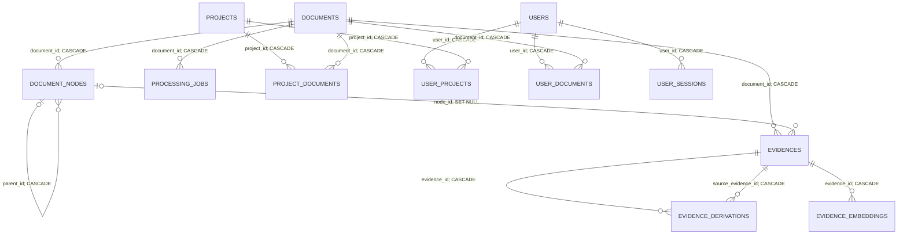

# Database relationships

## Purpose and source of truth

This document explains how EVA's MySQL/MariaDB tables cooperate. It complements [Database](11_DATABASE.md), which defines what is persisted, with cardinalities, foreign keys, application-level relationships, and actual lifecycle effects.

The structural sources are [`database/schema.sql`](../../database/schema.sql) and the ordered [`database/migrations/`](../../database/migrations/). Runtime behavior is defined by the services that write, query, and delete these records. The current main database has 14 tables and 15 foreign keys.

## Relationship overview



`audit_events` and `module_events` deliberately have no foreign keys. They hold logical references and sanitized snapshots without subordinating their lifecycle to Core entities.

## Foreign-key matrix

| Child table and column | Parent | Effective relationship | On parent deletion | Runtime purpose |
|---|---|---|---|---|
| `document_nodes.document_id` | `documents.id` | one document to zero or many nodes | `CASCADE` | Keeps the normalized tree inside one work. |
| `document_nodes.parent_id` | `document_nodes.id` | optional parent to zero or many children | `CASCADE` | Builds the tree; the root uses `NULL`. |
| `evidences.document_id` | `documents.id` | one document to zero or many evidence records | `CASCADE` | Supports document-scoped build, retrieval, and deletion. |
| `evidences.node_id` | `document_nodes.id` | optional node to zero or many evidence records | `SET NULL` | Anchors content and summaries to their structural origin. |
| `evidence_derivations.evidence_id` | `evidences.id` | one derived evidence to zero or many sources | `CASCADE` | Identifies the generated summary. |
| `evidence_derivations.source_evidence_id` | `evidences.id` | one source to zero or many derived records | `CASCADE` | Identifies every primary or derived input used. |
| `evidence_embeddings.evidence_id` | `evidences.id` | one evidence to zero or many vector versions | `CASCADE` | Subordinates retrieval vectors to persisted content. |
| `processing_jobs.document_id` | `documents.id` | one document to zero or many jobs | `CASCADE` | Associates the build queue with the work. |
| `project_documents.project_id` | `projects.id` | projects to documents, many-to-many | `CASCADE` | Defines project membership. |
| `project_documents.document_id` | `documents.id` | projects to documents, many-to-many | `CASCADE` | Allows a work to belong to several projects. |
| `user_projects.user_id` | `users.id` | users to projects, many-to-many | `CASCADE` | Grants whole-project access. |
| `user_projects.project_id` | `projects.id` | users to projects, many-to-many | `CASCADE` | Removes grants with their project. |
| `user_documents.user_id` | `users.id` | users to documents, many-to-many | `CASCADE` | Grants access to one specific work. |
| `user_documents.document_id` | `documents.id` | users to documents, many-to-many | `CASCADE` | Removes grants with their work. |
| `user_sessions.user_id` | `users.id` | one user to zero or many sessions | `CASCADE` | Subordinates authentication sessions to the identity. |

All foreign keys use `ON UPDATE RESTRICT`. Internal numeric IDs are not renamed; entities that cross API boundaries use their stable public IDs.

## Documentary aggregate

### Documents and nodes

`documents` is the aggregate root. Its numeric ID connects tree, evidence, jobs, project membership, and direct permissions. `public_id` (`EVA-D...`) is the stable external reference. `storage_path` points to the original source outside both SQL and the public web directory.

If source storage succeeds but the tree transaction fails, the document remains `failed` with its `storage_path`. A later administrative deletion uses that path to remove the source; SQL never deletes files by itself.

`document_nodes` is a self-referencing tree. The application creates one `NULL` parent root and recursively inserts descendants with the same `document_id`. `structural_path` is unique per document. The database validates the referenced rows, while the ingestion service guarantees that parent and child belong to the same document.

### Evidence and derivation lineage

Every evidence belongs to a document and normally to its source node:

- `primary/node_content` records preserve direct node content and are created as `validated`;
- `derived/node_summary` records preserve hierarchical summaries and are created as `generated`.

The direct `document_id` is intentional even though the document is also reachable through the node. Current application writes always provide `node_id`; its nullable `SET NULL` contract protects an evidence row if an isolated node is directly removed.

`evidence_derivations` is a directed evidence-to-evidence association:

```text
evidence_id (produced summary) -> source_evidence_id (input evidence)
```

Its composite key prevents duplicate edges. Leaf summaries can derive from their own primary content; upper summaries can derive from their own content and child summaries. The application guarantees that the target is derived, sources belong to the same document, and no cycle is introduced. Semantic retrieval follows this graph recursively until it reaches primary evidence, because only primary records may enter the citable answer context.

### Versioned embeddings

`evidence_embeddings` permits several representations while preventing duplicate `evidence_id + model + content_hash` versions. Build joins documents, nodes, and evidence to construct the structured input. Query retrieval selects the greatest embedding row ID for each evidence and active model, then computes cosine similarity and CIE regions in memory. Query vectors, similarities, and CIE results are not stored.

## Cognitive processing queue

`processing_jobs` belongs to a ready document and uses only `summaries` or `embeddings`. The unique `job_key` hashes document, stage, and version key, making repeated scheduling idempotent.

There is no foreign key between the two stages. The queue enforces the dependency logically: an embedding job can be claimed only after the document's latest summary job is complete. Retrying a failed summary can requeue its paired completed embedding job so the derived representation remains coherent.

The serialized `result` is operational progress. Evidence, derivations, and embeddings remain the durable documentary memory.

## Projects, users, and access resolution

`project_documents` makes projects and documents many-to-many. Either side can currently have no association, and one work can belong to several projects. A project `response_profile` is applied only when that project is explicitly selected and authorized; selecting one member document does not inherit the profile.

Normal-user document access is the union of two paths:

```text
direct grant: users -> user_documents -> documents
project grant: users -> user_projects -> active projects -> project_documents -> documents
```

A project grant follows future membership changes. A document grant exposes only that work. Duplicate coverage is resolved to one document ID. Selecting a project scope specifically requires `user_projects`; individual grants over some member works do not grant the whole project or its response profile.

The superadmin token is configuration, not a mandatory `users` row.

`user_sessions` stores only token hashes. Authentication joins sessions to active users, checks expiry, and updates `last_used_at`. Deleting a user cascades sessions and grants. Deactivation, password reset, and recovery also revoke sessions explicitly while retaining the identity.

## Logical relationships without foreign keys

### Audit events

`audit_events.entity_type + entity_id` is a polymorphic observability reference. Depending on the event, the ID can be numeric, public, or a route. It deliberately has no FK, so a sanitized historical record may survive deletion of the referenced entity. Metadata is a redacted snapshot, not documentary memory.

### Module mailbox

`module_events`, created directly by the consolidated schema, is an append-oriented mailbox. Migration `20260803_010_module_events.sql` preserves the upgrade path for older databases. Unique `event_id` provides idempotency and numeric `id` provides cursor order. Explicit time-based retention is the Runtime's only deletion path.

Its JSON may contain permitted snapshots of users, projects, documents, and public evidence IDs without foreign keys. Core deletion does not rewrite or cascade into past events. Each subscriber stores its cursor and domain state in an independent private SQLite database.

### Source files and public IDs

`documents.storage_path` links SQL to `storage/documents/`, but SQL cannot enforce filesystem integrity. `ContentDeletionService` commits the database deletion and then removes the source, reporting physical cleanup failures separately.

Document, evidence, and job public IDs are unique API contracts, not relational foreign keys. Internal consistency joins continue to use numeric IDs.

## How the tables cooperate in real flows

### Ingestion

```text
documents -> recursive document_nodes -> primary/node_content evidences
```

The document is registered first to obtain its ID and storage path. Nodes and primary evidence are inserted together in one transaction.

### Hierarchical summaries

```text
nodes + existing evidence -> derived/node_summary evidence
                          -> evidence_derivations for every input
```

Bottom-up processing creates a lineage that can be followed through child summaries to original primary content.

### Embeddings

```text
documents + nodes + eligible evidence -> structured input -> evidence_embeddings
```

An oversized primary unit may be represented by a compatible derived summary only when `evidence_derivations` proves that lineage.

### Query

```text
grants -> ready documents
documents + nodes + evidence -> literal/structural retrieval
evidence + embeddings -> semantic selection and CIE
derived evidence + derivations -> primary sources
primary evidence -> answer and citations
```

No CNode, similarity, CIE region, final context, or conversation row is inserted during this process.

### Completed answer

```text
validated answer -> sanitized audit_events
                 -> idempotent allowed module_events envelope
```

These operational writes never mutate the documentary aggregate.

## Deletion semantics

| Deleted entity | Automatic FK effect | Additional application effect | Preserved records |
|---|---|---|---|
| Document | nodes, evidence, connected derivation edges, embeddings, jobs, project links, direct grants | stored source removal after commit | audit and module events |
| Project through the product | project links and user grants | first deletes every attached work, including shared works, and their sources | audit and module events |
| User | sessions and both grant tables | none on documentary data | audit and module events |
| Evidence | embeddings and every derivation edge where it is target or source | not a normal standalone admin operation | document and node |
| Isolated node | descendants; directly linked evidence receives `node_id = NULL` | not a normal admin operation | evidence and document |

A raw SQL deletion of `projects` would cascade only to `project_documents` and `user_projects`. The product service deliberately performs the broader work deletion first. Administrative operations must use the application contract.

## Database and application invariants

Foreign keys guarantee referenced existence, uniqueness, and declared cascades. Application services additionally guarantee:

- parent, child, node, and evidence document consistency;
- same-document, acyclic derivation lineage with a derived target;
- ready-only queueing and querying;
- active-model and compatible-dimension embedding use;
- summary-before-embedding ordering;
- active-project and ready-document authorization;
- explicit project selection before applying response profiles;
- audit and module payload sanitization.

Direct administrative SQL writes must not bypass these transactions and validations.

## Deliberately absent Core relations

There are no tables for CNodes, `simetry`/`assimetry` pairs, chat messages, similarities, CIE regions, final context, confidence, or cognitive weights. These values are transient. SQL preserves verifiable documentary memory and bounded operational events, not an accumulating cognitive network.

## Installation verification

In the current versioned state, `database/schema.sql` creates all 14 main-database tables, including `module_events`. A fresh installation imports only that file. An existing installation applies every outstanding migration in filename order; `20260803_010_module_events.sql` remains idempotent and upgrades databases created before the mailbox entered the consolidated schema.

```sql
SHOW TABLES LIKE 'module_events';

SELECT COUNT(*) AS foreign_key_count
FROM information_schema.referential_constraints
WHERE constraint_schema = DATABASE();
```

For the version documented here, the first query returns `module_events` and the second returns `15`.
